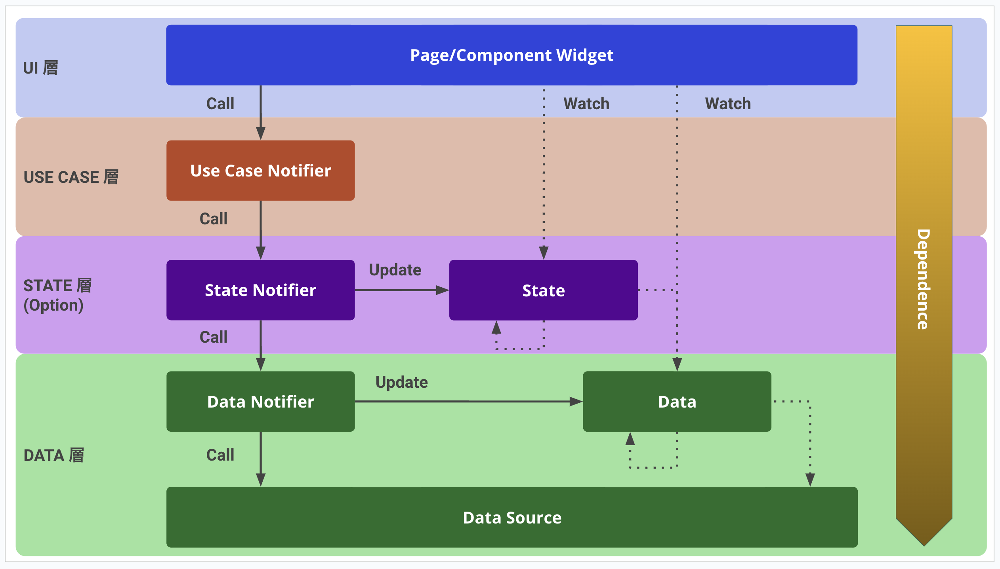

# repeat_notification_app

A new Flutter project.

## 開発環境

開発マシンは MacOS 、IDE は　VSCode の利用を前提としています。

Windows や Android Studio でも利用できますが、適宜読み替えてください。

## セットアップ

### Flutter SDK を利用可能にする

Flutter SDK のバージョン管理ツールに [fvm](https://pub.dev/packages/fvm) を利用しています。次のコマンドを実行して `fvm flutter` を利用できる状態にしてください。

```
# ルートディレクトリで実行
dart pub global activate fvm
fvm install
```

### flutter pub get

次のコマンドを実行してください。実行すると、`flutter pub get` を実行してくれます。

```
# ルートディレクトリで実行
make pub-get
```

その他便利なコマンドは [Makefile](Makefile) に用意しています。

### アプリをビルドする

ビルドしたい構成を選択して、アプリをビルドできます。

パッケージ名|説明
--|--
app-debug|デバッグ版

## アーキテクチャ

riverpod 2 アーキテクチャを採用しています。



### UI 層

- 画面やコンポーネントなどの Widget 群
- 下位層のデータを受け取って画面に表示する
- ユーザーイベントを受け付けて USE CASE 層に移譲する

### USE CASE 層

- ユーザーイベントを処理するビジネスロジック
- STATE 層と DATA 層を呼び出してデータを変更する
- `material.dart` に依存しない

### STATE 層

- STATE 層と DATA 層のデータを加工／統合（クライアントサイドジョイン）したデータ
- USE CASE 層向けにデータの更新メソッドを提供する

### DATA 層

- データソースから上位層へ供給するデータ
- USE CASE 層向けにデータの更新メソッドを提供する
- Firestore の場合は `snapshot()` を監視すれば Stream でデータが流れてくるので Data Notifier は不要

## フォルダ構成

feature first を採用しています。lib 配下のフォルダ構成は次のとおりです。

フォルダ|説明
--|--
`core`|機能間で共通の部品
`feature`|機能毎にひとまとめ
`router`|ルーティング関連
`util`|どこからでもアクセスできる便利機能<br>例：定数、ロガー、アナリティクス、extension など

`core` と `feature/<機能名>` 配下は次のようなフォルダ構成になります。

フォルダ|説明
--|--
`data`|DATA 層のファイル
`state`|STATE 層のファイル
`use_case`|USE CASE 層のファイル<br>原則 1 クラス 1 ファイル
`ui`|UI 層のファイル<br>画面クラスは `ui` フォルダ直下に入れる<br>UI 部品は `component` サブフォルダに入れる

## 開発プロセス

### ブランチモデル

ブランチモデルは git-flow を採用しています。知らない場合は次の Qiita の記事を読んでみてください。

[【Qiita】Git-flowって何？](https://qiita.com/KosukeSone/items/514dd24828b485c69a05)


### コードの自動生成

次のパッケージを利用する場合は、適宜コードの自動生成が必要です。

- [riverpod_generator](https://pub.dev/packages/riverpod_generator)
- [auto_route_generator](https://pub.dev/packages/auto_route_generator)
- [freezed](https://pub.dev/packages/freezed)
- [flutter_gen_runner](https://pub.dev/packages/flutter_gen_runner)

次のコマンドを実行しておくことで、ファイルの保存を契機に自動でコード生成を行ってくれます。watch はまれによくエラーが起きます。エラーがおきたらコマンドを再実行してください。

```
# 各パッケージディレクトリで実行
make build-runner-watch
```

手動で行う場合は次のコマンドを実行してください。

```
# 各パッケージディレクトリで実行
make build-runner-build
```

以上
